### 游戏服务器框架设计（改进版）

#### 1. 服务器框架目标
##### 1.1 可扩展, 支持游戏扩容、合服、转服等操作. 运行时方便添加机器;
##### 1.2 可观测, 通过日志、指标与链路追踪清晰看到服务器运行情况, 包括 QPS、延迟分布(P50/P99)、错误率、CPU/内存负载等;
##### 1.3 高可维护性, 服务器分维护阶段、运行阶段. 维护阶段只有白名单账号可以进入游戏;
##### 1.4 平衡 C++ 和 Lua 脚本的使用, 大部分业务逻辑通过 Lua 热更, 性能要求高的模块(战斗、寻路等核心框架)由 C++ 编写;
##### 1.5 数据存储, 使用 Redis 作为缓存、PostgreSQL 作为数据库, 对玩家数据进行持久化;

---

#### 2. 架构拓扑

##### 2.1 整体架构图

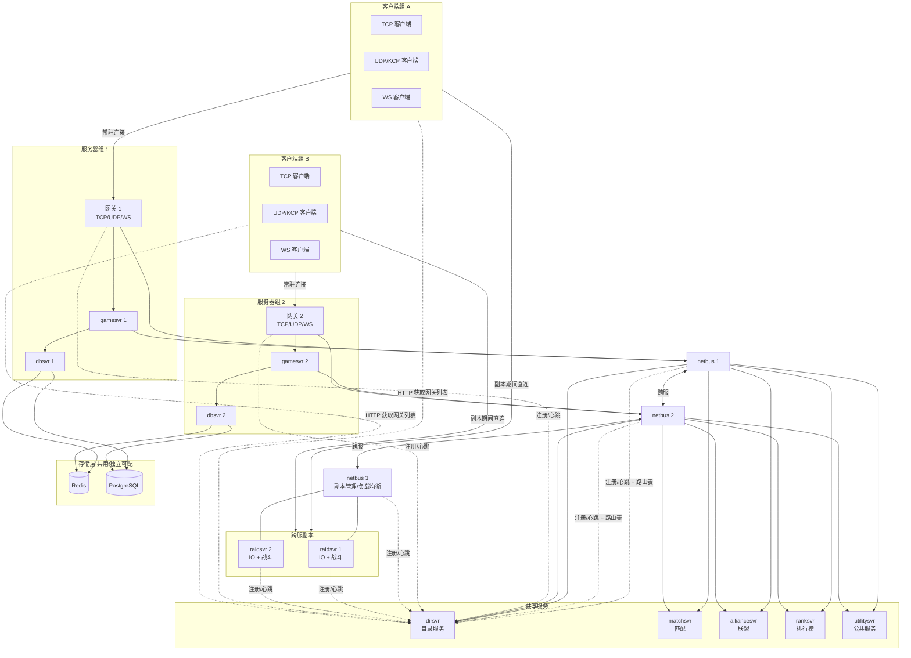

说明:
- **常驻连接**: 客户端与网关始终保持一条长连接, 处理登录、聊天、背包等非战斗消息. 进入副本后不断开, 避免退出副本时重新认证
- **副本期间直连**: 客户端与 RaidSvr 新建第二条连接, 战斗消息(移动/技能/伤害)零跳直达. 副本结束后关闭 RaidSvr 连接, 恢复单连接状态
- **RaidSvr**: 具备客户端接入能力(TCP/UDP/KCP), IO 线程与战斗逻辑线程分离互不阻塞. 玩家数据通过异步 RPC 从 GameSvr 获取, 结算后回写
- **NB3**: 只负责副本管理(创建/销毁/负载均衡)和临时 token 签发, 不转发战斗消息
- **服务器组**: 网关 + gamesvr + dbsvr 为一组. 网关直连 gamesvr, gamesvr 连本组 netbus 用于跨服和共享服务
- **netbus 互联**: NB1 ↔ NB2 ↔ NB3, 跨服消息通过互联链路转发
- **共享服务**: matchsvr、alliancesvr、ranksvr、utilitysvr、dirsvr 由 NB1/NB2 共享
- **存储层**: Redis/PostgreSQL 可按服务器组独立部署, 也可多组共用
- **实线**: 业务消息链路; **虚线**: 服务发现/注册链路

##### 2.2 部署拓扑(示意)
| 服务 | 实例数 | 部署说明 |
|------|--------|----------|
| 网关 | N | 每个服务器组一个, 与 gamesvr 同组 |
| netbus | 3+ | 同一代码多实例, 配置区分 NB1(服内)/NB2(服内)/NB3(副本管理), 互联成网 |
| dirsvr | 2+ | 主备, 存储全部服务状态 |
| gamesvr | N | 按区服/玩家量分片, 只连本组 netbus |
| raidsvr | N | 连 NB3 + 暴露客户端端口, IO/战斗线程分离 |
| matchsvr | 1+ | 按匹配池分片 |
| alliancesvr | 2+ | 主备, 存储全部服务状态 |
| ranksvr | 1+ | 主备, 存储全部服务状态 |
| dbsvr | 2+ | 主备, 保证数据同步可靠性 |
| utilitysvr | 1+ | 无状态, 可水平扩展 |

##### 2.3 物理部署建议

| 组合 | 说明 |
|------|------|
| 网关 + gamesvr + dbsvr | 同属一个服务器组, 推荐同机部署, 减少跨机通信. 网关和 gamesvr 直连走 Unix Socket 或本地 TCP |
| NB3 + RaidSvr | 可同机部署. NB3 不转发战斗消息, CPU 负载低, 不影响 RaidSvr 战斗计算 |
| netbus (NB1/NB2) | 独立部署, 作为消息中枢需保证网络带宽和稳定性 |
| dirsvr | 独立部署, 全局依赖, 避免与其他服务争抢资源 |
| Redis / PostgreSQL | 独立部署或云服务, 根据数据量和性能需求决定 |

##### 2.4 运行时扩容

**新增服务器组**:

1. 新机器部署 网关 + gamesvr + dbsvr, 启动后向 dirsvr 注册
2. dirsvr 通知 NB1/NB2: 新 gamesvr 上线, 路由表更新
3. 客户端从 dirsvr 获取到新网关, 新玩家可选择新服进入
4. 已在线玩家不受影响

**新增 RaidSvr**:

1. 新 RaidSvr 启动, 向 dirsvr 注册, 连 NB3
2. NB3 收到 dirsvr 通知: 新 RaidSvr 可用, 负载表扩充
3. 新副本开始分配到新实例

---

#### 3. 服务详细设计

##### 3.1 网关 (gateway)
负责和客户端的常驻连接, 与 gamesvr 同属一个服务器组. 支持多种协议: TCP、WebSocket、UDP.

- 启动时向 dirsvr 注册, 客户端登录时从 dirsvr 获取网关列表后选择连接
- 负责握手、断线重连、心跳维持
- UDP 支持可靠传输 (基于 KCP 协议实现)
- 弱网环境下自动切换 TCP/UDP
- 客户端消息基础校验 (防篡改签名验证、防重放 seq/timestamp)
- 直连 gamesvr 收发服内消息
- **副本期间**: 网关连接保持不断, 处理非战斗消息(聊天/背包/邮件等); 客户端同时建立第二条连接至 RaidSvr. 副本结束后自动恢复, 无需重新认证

##### 3.2 netbus (消息总线)
**同一套代码, 多进程实例, 通过配置区分角色.** 和网关及业务服相连, 是消息内外转发的核心枢纽.

- **NB1 / NB2 (服内路由)**: 连接各服务器组的网关和 gamesvr, 负责服内消息转发及共享服务路由
- **NB3 (副本管理)**: 连接 raidsvr 集群, 负责副本创建/销毁、负载均衡、临时 token 签发. 不转发战斗消息(客户端直连 RaidSvr)

netbus 互联网络: NB1 ↔ NB2 ↔ NB3, 跨服消息通过互联链路转发. gamesvr 只连接本组 netbus, 不跨接多个 netbus.

**NB3 高可用**: 单主 + 热备. 主处理副本创建, 内存中维护 raidsvr 负载表. 备挂起, 主挂了备接管, 从 dirsvr 拉 raidsvr 列表重建负载表(副本计数从 0 开始, 数秒内收敛). 副本创建频率远低于消息转发, 单实例足够, 无需多实例一致性.

- 路由方式: 按玩家 ID、账号 ID、消息类型、服务器类型、服务器实例 ID 路由
- 从 dirsvr 获取实时路由表, 感知下游服务的上线/下线
- 支持点对点、广播、多播(按服务器类型组播)
- 消息可靠性: at-least-once 投递, 关键消息支持 ACK
- 背压处理: 下游积压时限流(返回错误码), 避免 OOM
- 消息队列: 按玩家 ID 保证同一玩家消息有序
- **Token 签发**: HMAC 签名, 绑定 playerId + raidId, 密钥在各 NB3 实例间共享, 任意实例均可签发. 初始有效期 60s(仅用于首次连接建立), 副本期间玩家活动自动续期

##### 3.3 dirsvr (目录服务) —— 新增
负责服务发现与注册, 维护所有服务器实例的状态和列表.

- **服务注册**: 各服务启动时向 dirsvr 注册 (服务类型、实例 ID、IP:Port、权重)
- **心跳检测**: 服务定期上报心跳 (如 3s 间隔), dirsvr 超时(如 10s)标记为不可用
- **服务发现**: netbus 和其他服务从 dirsvr 拉取/订阅服务列表变更
- **健康检查**: dirsvr 主动对注册服务进行健康探测 (TCP 连接检查)
- **数据存储**: 服务列表以内存为主, 可落地到本地文件用于重启恢复
- **高可用**: 至少部署 2 个实例 (主备), 主挂掉后备自动接管, 通过 etcd 或简单选举机制切换
- **扩容感知**: 新机器上线 → 向 dirsvr 注册 → netbus 收到变更通知 → 自动加入路由

##### 3.4 gamesvr (游戏服)
负责玩家数据管理以及世界数据的维护.

- 玩家通过 playerId hash 分配到固定 gamesvr 实例
- 直连网关接收服内消息, 同时连本组 netbus 用于跨服消息和共享服务调用
- 玩家数据以 Player 对象管理, 包含生命周期:
  preLoad → load → preLogin → login → afterLogin → ... → logout → save
- 世界数据(大地图、公共场景)可按区域分片, 由视野同步线程处理
- 跨服/转服时, 玩家数据从源 gamesvr 迁移到目标 gamesvr, 通过 dbsvr 保证数据一致
- 玩家进入跨服副本时: 记录快照 `{playerId, raidId, 带入道具, 初始属性}`, 异步 RPC 推送战斗属性至 RaidSvr; 副本期间接收 RaidSvr 消耗流水; 结算后接收回写并更新玩家数据. 若 RaidSvr 宕机, 用快照 + 已收流水恢复

##### 3.5 raidsvr (副本服)
负责跨服副本玩法, 具备客户端接入能力. 内部线程模型:

- **IO 线程**: 负责客户端连接的收发、编解码、心跳维持. 支持 TCP/UDP(KCP)/WebSocket
- **战斗逻辑线程**: 从消息队列取包, 执行副本战斗计算. 与 IO 线程隔离, 互不阻塞
- **消息校验**: 客户端消息签名校验、防重放(复用网关校验模块)

**副本进入流程 (单人)**:

1. GameSvr 向 NB3 申请副本, NB3 根据负载分配 RaidSvr 实例
2. NB3 生成临时 token (绑定 `playerId + raidId`, HMAC 签名), 返回 RaidSvr 地址 + token
3. GameSvr 通过网关告知客户端: "连接 RaidSvr, 地址 X, token Y"
4. 客户端新建连接至 RaidSvr, 发送 token 校验, 校验通过后进入副本. 副本期间玩家有消息活动则自动续期 token
5. 网关连接保持不断, 非战斗消息(聊天/背包/邮件)仍走网关

**组队跨服副本**:

1. 队长 gamesvr_A 向 NB3 申请副本, 传入所有队员 playerId 列表
2. NB3 分配 RaidSvr, 为每个队员批量签发 token, 返回 `{raidsvr地址, tokens[]}`
3. 队长 gamesvr_A 通知各队员所在 gamesvr(通过 NB1 ↔ NB2 跨服消息)
4. 各 gamesvr 推送战斗属性至 RaidSvr, 同时通知各自队员连接 RaidSvr
5. RaidSvr 等待所有队员到齐(超时 15s 未到齐则取消副本, 退还道具)
6. 全部到齐后开始战斗

**副本期间**:

- **战斗消息**: `Client ↔ RaidSvr`, 零跳直达. 移动、技能、伤害、Buff 等高频包
- **断线重连**: RaidSvr 保留玩家副本状态 15s, 客户端可用原 token 直连重连; 超时判定退出, RaidSvr 异步通知 GameSvr 结算
- **数据读写**: RaidSvr 通过异步 RPC 从 GameSvr 获取玩家战斗属性. 副本期间 RaidSvr 异步发送消耗流水至 GameSvr(道具消耗、Buff 变更等), 路径: `RaidSvr → NB3 → NB2 → NB1 → GameSvr`. 结算后回写最终结果
- **宕机恢复**: GameSvr 进入副本时记录 `{playerId, raidId, 带入道具, 初始属性}` 快照; 副本期间接收 RaidSvr 消耗流水. 若 RaidSvr 宕机, 用快照 + 已收流水恢复玩家数据, 无需增量快照
- **非战斗消息**: 仍走网关, 不受副本影响

**副本退出**:

1. RaidSvr 清算战斗结果, 异步 RPC 回写各队员 GameSvr
2. RaidSvr → Client: "副本结束, 断开"
3. 客户端关闭 RaidSvr 连接, 网关连接恢复到全量消息
4. 无需重新登录或认证 — 网关连接从未断开

##### 3.6 matchsvr (匹配服)
根据玩家实力、积分、延迟等规则匹配能力相近的玩家. 自身无状态, 匹配成功即完成使命, 不负责副本创建.

- 支持多种匹配池 (如 1v1、3v3、大乱斗)
- 玩家信息(积分/段位)由 gamesvr 在加入匹配队列时上报
- 匹配超时后放宽条件, 缩短等待时间
- 匹配成功后通知队长所在的 gamesvr, 由 gamesvr 统一向 NB3 申请副本

##### 3.7 alliancesvr (联盟服)
负责玩家联盟的创建、解散、添加成员、权限管理、联盟战等操作.

- 联盟数据独立存储, 联盟成员通过 playerId 关联
- 支持联盟排行榜 (委托 ranksvr)
- 跨服联盟需要 utilitysvr 协调

##### 3.8 ranksvr (排行榜服)
负责排行榜信息的维护和查询.

- 使用 Redis Sorted Set 作为排行数据结构
- 支持多种排行类型 (战力榜、等级榜、竞技榜等)
- 定时(如每小时)将 Redis 排行数据同步到 PG
- 高并发场景下可对排行榜按段分片

##### 3.9 dbsvr (数据库服)

**Redis 定位**: 存放玩家 KV 数据(道具、装备、背包等)和排行榜 Sorted Set.

**职责划分**:

| 数据类型 | 写入路径 | 说明 |
|----------|----------|------|
| 玩家 KV 数据(道具/装备/背包等) | Redis → PG(定时 30s 批量) | 玩家在线期间读写走 Redis, 定时落地 PG |
| 排行榜 | Redis Sorted Set → PG(定时每小时) | 排行数据在 Redis 中维护, 定时同步 PG |
| 邮件 | 直接写 PG | 关系型数据, 不适合 KV 存储 |
| 充值 | 直接写 PG | 重要性高且具有关系/事务特征, 实时持久化 |

- **失败补偿**: PG 写入失败时写入失败队列, 指数退避重试, 超过阈值告警
- **数据恢复**: Redis 采用 AOF 持久化, 重启后自动恢复; gamesvr 中记录玩家操作流水(保留 30 天, 存储在 PG), 极端情况下通过流水 + GM 工具为玩家恢复数据
- **写入冲突**: 玩家数据按 playerId 绑定到固定存储线程, 避免多写

##### 3.10 utilitysvr (公共服务服)
负责跨服公共数据管理.

- 全局配置下发 (活动配置、数值表等)
- 跨服邮件、公告
- 全局计数器 (如全服击杀数)
- 注意: 避免成为"万能垃圾桶", 新增功能优先评估是否归属到更具体的服务

##### 3.11 GM 工具
GM(游戏管理员)工具连接 netbus, 理论上可向任意服务器发送管理指令.

- 连接任意 netbus 实例, 通过 netbus 互联网络路由到目标服务
- 常用指令: 查询玩家数据、下发道具、封号/解封、强制下线、查看在线人数、触发活动
- 指令通过 protobuf 定义, 与业务消息共用协议体系
- 访问控制: GM 工具连接需要内部认证, 操作记录日志审计

##### 3.12 热更新
- **Lua 热更**: 将 Lua 脚本按模块组织; 支持灰度热更(先更新部分实例观察)
- **配置热更**: gamesvr、raidsvr、alliancesvr、utilitysvr 等服上传配置文件后 reload 加载. 加载时检查配置合法性; reload 指令支持加载指定的配置文件列表
- **C++ 热更**: 非必要不热更 C++ 模块; 如需热更, 通过动态库(.so)热加载, 但需在维护窗口内执行

---

#### 4. 通信方式

##### 4.1 客户端 ↔ 网关 (常驻连接)
- 网关接受客户端 TCP、UDP(基于 KCP 可靠传输)、WebSocket 数据
- 客户端消息签名校验: HMAC(消息体 + timestamp + seq, 密钥)
- 弱网自动切换: 网关检测 RTT > 阈值 → 建议客户端切换 UDP(KCP)
- 连接生命周期与玩家在线时间一致, 进入副本不断开

##### 4.2 客户端 ↔ RaidSvr (副本连接)
- 副本期间客户端新建第二条连接至 RaidSvr
- 连接建立时发送临时 token (NB3 签发, HMAC, 绑定 playerId + raidId). 初始有效期 60s 用于连接建立, 副本期间玩家活动自动续期
- RaidSvr 校验 token 后确认身份, 不经过完整登录流程
- 副本结束 RaidSvr 通知客户端断开, 客户端恢复单连接

##### 4.3 网关 ↔ gamesvr / netbus ↔ 业务服
- 网关直连 gamesvr 收发服内消息, 不再经过 netbus 中转
- netbus 从 dirsvr 获取完整路由表, 订阅变更通知
- 路由策略:
  - 按玩家 ID hash → 固定 gamesvr 实例 (保证同一玩家消息有序)
  - 按服务器类型 → 轮询/随机 → 无状态服务(utilitysvr)
  - 按消息类型 → 直接路由到特定服务 (排行榜消息 → ranksvr)
- netbus 维护按 playerId 的消息队列, 保证同一玩家消息按序投递
- netbus 对下游服务进行健康跟踪, 不可用实例自动摘除

##### 4.4 服务间 RPC
- 业务服之间通过 RPC 调用 (protobuf 作为 IDL + 序列化)
- **同步 RPC**: 在协程中调用, 挂起当前协程等待返回 (C++20 coroutine 实现)
- **异步 RPC**: 提供回调或 Future/Promise 接口
- **超时处理**: RPC 调用方设置超时时间 (默认 5s), 超时后返回错误
- **重试策略**: 幂等接口可重试 (最多 3 次), 非幂等接口不自动重试
- **限流熔断**: 下游错误率超过阈值(如 50% 错误率), 自动熔断 30s, 期间快速失败

##### 4.5 协议规范
- 服务器↔客户端、服务器↔服务器, 通信协议采用 protobuf 3
- proto 文件按服务模块独立管理, 统一放在 `proto/` 目录下 (如 `proto/player.proto`)
- 协议版本号包含在消息头, 向后兼容策略:
  - 新增字段使用新的 field number, 不删除/复用旧字段号
  - 客户端版本落后时, 服务器兼容处理 (忽略新字段)
  - 不兼容变更需两端同步升级
- **客户端最低版本**: 通过配置下发最低客户端版本号. 登录时网关校验客户端版本, 低于最低版本则拒绝连接并提示强制更新. 配置支持热更, 运维可随时调整

---

#### 5. 技术选型

##### 5.1 开发语言 & 核心库
- **C++20**: 核心框架、高性能模块(战斗、寻路、网络层)
- **asio**: 网络 IO, 跨平台异步 I/O, 支持 C++20 coroutine
- **Lua**: 业务逻辑, 支持热更 (C++ 通过 sol2 绑定暴露接口给 Lua)
- **Lua 沙箱**: 限制 Lua 脚本的 OS/IO 调用, 防止脚本影响服务器稳定性

##### 5.2 缓存
- Redis 作为玩家数据缓存, 采用**全量缓存**模式 (玩家在线期间全量数据在 Redis)
- 缓存策略: Write-Behind (写 Redis 立即返回, 异步写 PG)
- Redis 集群模式 (Redis Cluster) 用于分片和故障转移

##### 5.3 数据库
- PostgreSQL 负责数据落地, 按 playerId 分表 (如 player_data_00 ~ player_data_99)
- 充值记录、邮件等关系型数据实时写入 PG; 玩家 KV 数据(道具/装备)由 Redis 定时批量同步至 PG
- PG 使用云产品托管, 自动备份(全量 + WAL), 无需手动管理备份策略

##### 5.4 日志与可观测性
- **日志**: 结构化 JSON 格式, 包含 uid(playerId)、服务名、时间戳、级别. 业务流水通过 uid 关联, 需要链路追踪时各服务自行按需生成 traceId/spanId
- **UUID**: 服务器统一生成 UUID, 防止不同服务实例间 ID 重复
- **日志存储**: ClickHouse — 支持 SQL 查询和生成报表
- **指标采集**: Prometheus + Grafana
  - 关键指标: QPS、延迟(P50/P99)、错误率、连接数、CPU/内存、协程数
  - 业务指标: 在线人数、副本完成率、匹配耗时
- **告警**: 错误率突增、延迟 P99 超过阈值、服务实例不可用

##### 5.5 协程
- C++20 coroutine, 配合 asio 的 `co_await` / `co_spawn`
- 同步 RPC 在协程中挂起等待, 不阻塞逻辑线程; 异步任务通过 `asio::co_spawn` 投递
- 每个逻辑线程一个 `asio::io_context`, 协程在 io_context 上调度

##### 5.6 Lua ↔ C++ 绑定
- 使用 sol2 库绑定
- 暴露给 Lua 的接口规范: 统一错误码、统一日志输出、不透传原始指针

---

#### 6. 服务发现与高可用

##### 6.1 服务生命周期

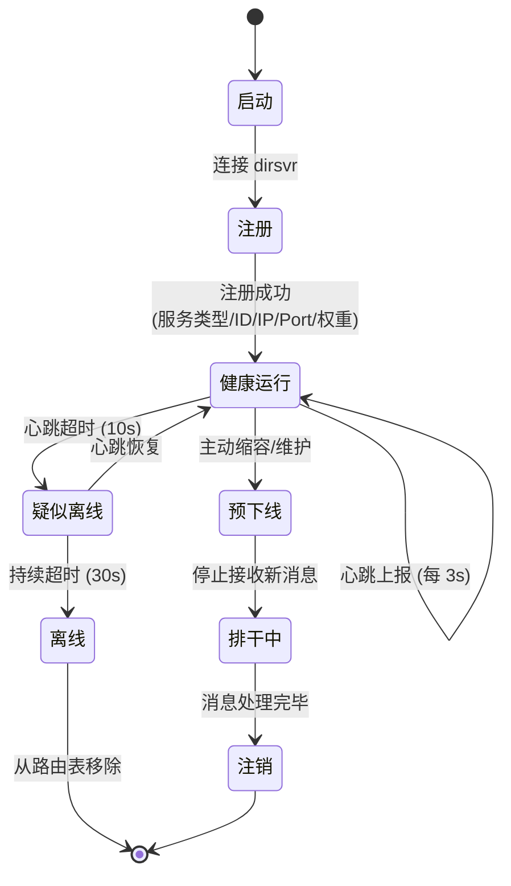

##### 6.2 心跳与故障检测
- 每个服务实例每 3s 向 dirsvr 发送心跳
- dirsvr 超过 10s 未收到心跳 → 标记实例为 UNHEALTHY, 通知订阅者
- 超过 30s 未恢复 → 标记为 OFFLINE, 从路由表移除
- dirsvr 自身: 部署 2 实例, 使用简单选举(Redis 分布式锁 / RAFT) 决定主备

##### 6.3 扩缩容流程

**扩容:**

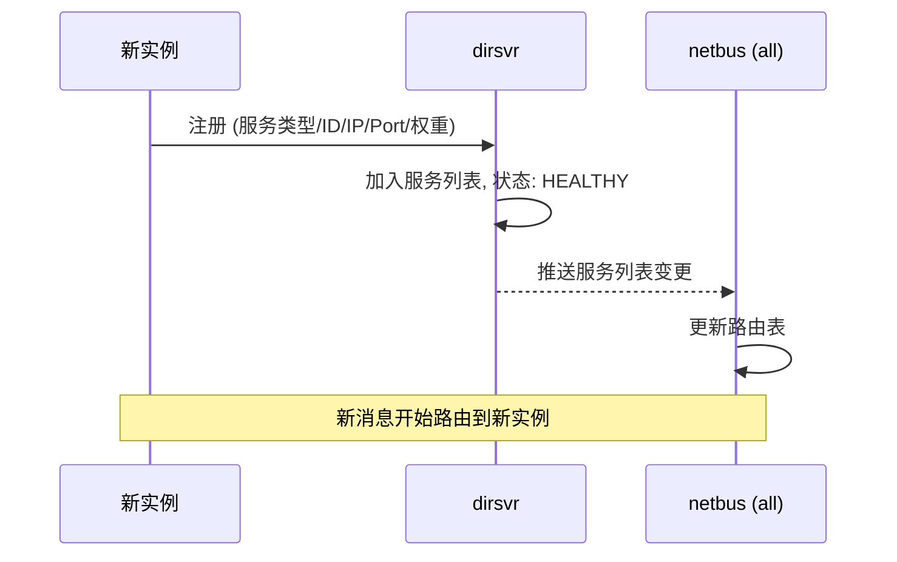

**缩容:**

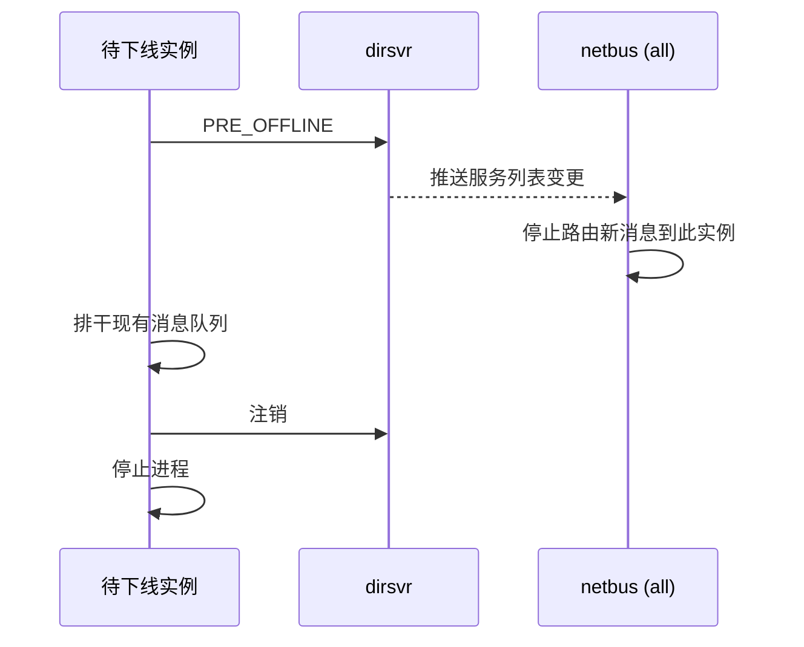

##### 6.4 容灾
- **netbus 故障**: 服内消息(网关直连 gamesvr)不受影响; 跨服消息和共享服务暂不可用, netbus 恢复后自动重连. NB1/NB2 互备. NB3 单主+热备, 备接管后从 dirsvr 重建负载表, 数秒内恢复副本创建能力
- **raidsvr 故障**: NB3 标记实例不可用, 通知受影响玩家通过网关退出副本(视为中断/平局). 玩家数据由 GameSvr 根据进入副本时记录的快照 + 副本期间 RaidSvr 异步发送的消耗流水恢复, 保证不丢道具
- **dirsvr 故障**: 主备切换, 备升主后从本地文件恢复服务列表
- **gamesvr 故障**: 该服玩家需重新登录并分配到其他 gamesvr (数据在 Redis 中, 无状态恢复)
- **dbsvr 故障**: 主备切换, 备接管同步任务

---

#### 7. 线程模型

##### 7.1 基础线程划分
所有服务进程(网关/gamesvr/raidsvr/netbus/dbsvr)共用此线程模型:

- **IO 线程池** (1~N 个线程): 每个线程绑定 `asio::io_context`, 负责网络数据的收发. 读取消息放入消息队列, 从写队列取出响应写入连接
- **逻辑线程池** (1~N 个线程): 每个线程绑定 `asio::io_context`, 从消息队列取消息, 执行业务逻辑(协程调度在此), 处理后将响应放入写队列

gamesvr 仅开 TCP 端口, 内部通信; raidsvr 按需开 TCP/UDP/WS 端口, 客户端接入.

##### 7.2 逻辑线程分配策略
- **玩家绑定**: 同一 playerId 的消息始终路由到同一逻辑线程 (通过 hash), 避免玩家数据加锁
- **世界线程**: 大地图、视野同步等计算密集任务可独立为一个或多个线程
- **DB 线程**: Redis/PG 的 IO 操作独立线程, 避免阻塞逻辑线程

##### 7.3 消息队列

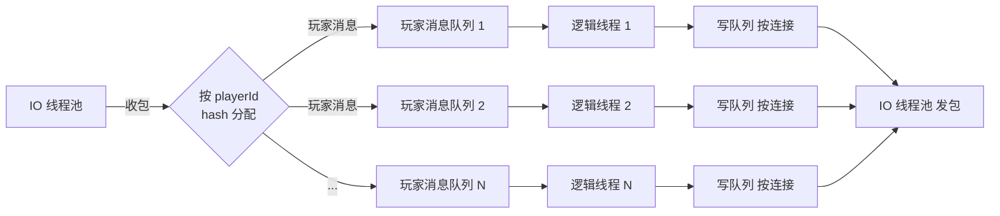

---

#### 8. 安全设计

##### 8.1 客户端安全
- 消息签名: HMAC-SHA256(消息体 + timestamp + seq, 客户端密钥), 服务端校验, 防止篡改和重放. 网关和 RaidSvr 复用相同校验模块
- 加密: 登录和支付相关消息使用 TLS 加密
- 反外挂: 服务端校验关键操作 (移动距离校验、攻击频率校验、道具数量校验)
- **副本 token**: 临时 token 由 NB3 签发(HMAC 签名, 绑定 playerId + raidId). 初始有效期 60s, 仅用于首次连接建立. 连接建立后, 玩家在副本期间有消息活动则自动续期, 副本结束或掉线超时 15s 后 token 失效

##### 8.2 服务间安全
- 服务间通信使用内网隔离 (VPC/私有网络)
- 服务间 RPC 携带内部 Token 认证

##### 8.3 维护模式
- 维护阶段: dirsvr 下发维护标记, 网关只允许白名单 IP/账号建立连接
- 在线玩家收到维护通知并踢下线; 白名单账号正常游戏

##### 8.4 DDoS 防护
- 网关层前置云厂商高防 IP
- 单 IP 连接数/消息频率限制
- 协议异常包检测与丢弃

---

#### 9. 公共服务器框架

所有服务进程(网关、netbus、gamesvr、raidsvr、dbsvr 等)共用同一套基础框架, 差异通过配置和功能开关区分.

##### 9.1 通用能力

| 模块 | 说明 |
|------|------|
| 网络 IO | 基于 asio, TCP/UDP/KCP/WS 多协议支持, 按配置开启. 如 gamesvr 只开 TCP(内部通信), 网关全开 |
| 消息队列 | 收包 → 按 playerId hash → 逻辑线程队列 → 处理 → 写队列 → 发包 |
| 逻辑线程池 | 可配置线程数, playerId 绑核 |
| 消息分发 | Protobuf Descriptor 做 key, 模板自动注册 Handler. Command/Handler 模式, Handler 编排多模块调用. 所有服务共用 | 
| RPC 框架 | 同步/异步, protobuf, 超时/重试/熔断 |
| dirsvr 注册 | 启动注册 + 心跳维持 |
| 日志/指标/traceId | 统一日志格式, Prometheus 指标, 链路追踪 |
| UUID 生成 | 统一 ID 生成器, 防止不同服务实例间 ID 重复 |
| 配置加载 | 启动加载 + reload 热更 |
| 生命周期管理 | 统一启动/停止/维护接口 |

##### 9.2 服务代码复用

- **netbus**: 同一套代码, NB1/NB2/NB3 通过配置区分角色(服内路由/副本管理)
- **gamesvr / raidsvr**: 共用同一套代码. 差异通过功能开关控制:
  - `game_mode`: gamesvr 模式 — 玩家数据管理、世界逻辑、背包、装备等模块
  - `raid_mode`: raidsvr 模式 — 客户端接入、战斗逻辑、副本生命周期
  - 网络协议: gamesvr 仅开 TCP(内部通信), raidsvr 开 TCP/UDP/WS(客户端接入)
- **网关**: 独立代码(客户端接入逻辑差异大), 复用网络 IO 和消息校验模块
- **dbsvr**: 独立代码(数据同步逻辑), 复用网络 IO 和 RPC 框架

##### 9.3 功能开关示例

```
# 以 gamesvr 模式启动
./server --mode=game --tcp_port=9000

# 以 raidsvr 模式启动
./server --mode=raid --tcp_port=9001 --udp_port=9002 --ws_port=9003
```

##### 9.4 消息分发 (所有服务共用)

每个 proto message 对应一个 Handler, Handler 内部编排调用各模块. 所有服务(网关/netbus/gamesvr/raidsvr/matchsvr 等)共用此机制.

```
class UseItemHandler : public HandlerBase {
public:
    void handle(const UseItemReq& req) {
        auto item = inventory().remove(req.item_id(), req.count());
        buff().apply(item.effect());
        quest().onItemUsed(req.item_id());
    }
};

dispatcher.registerHandler<UseItemReq>(UseItemHandler{});
```

- **注册**: `MessageDispatcher::registerHandler<T>()`, 以 Protobuf Descriptor 为 key, 模板自动提取类型
- **分发**: `MessageDispatcher::dispatch(msg, player)`, 按 Descriptor 查表投递
- **HandlerBase**: 提供 `inventory()` / `buff()` / `quest()` 等快捷访问, 子类直接使用
- 优点: 不写 switch-case, 多模块调用编排集中可见, Handler 独立可测, 模块间解耦

##### 9.5 服务器生命周期
服务器有统一的启动、热更、停止、维护等接口:

**启动流程:**

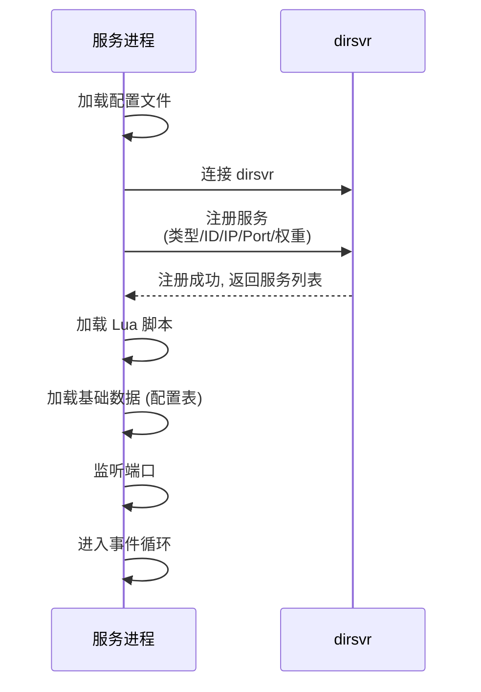

**停止流程:**

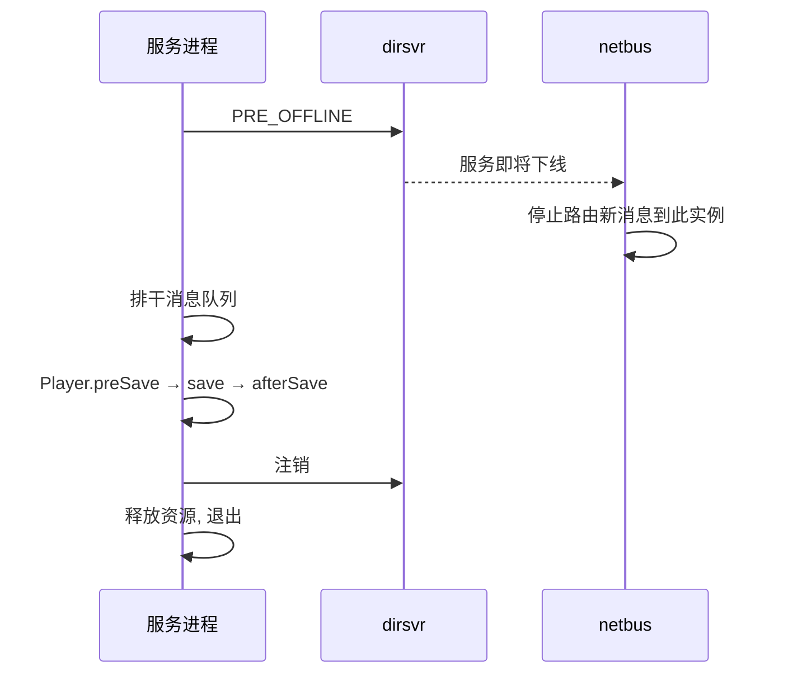

**维护流程**: dirsvr 下发维护标记 → 拒绝非白名单连接 → 踢下线非白名单玩家 → 保存数据 → 执行维护操作(升级/迁移/热更)

**热更流程**: 灰度选择实例 → 通知在线玩家进入安全状态 → 加载新脚本/配置 → 验证(监控错误率) → 全量推广或回滚

##### 9.6 Player 对象
Player 对象包含各种功能模块, 每个模块继承自基类 `PlayerModule`:

```
class PlayerModule {
public:
    virtual void preInit()    = 0;   // 模块预初始化(加载配置)
    virtual void init()       = 0;   // 模块初始化
    virtual void inited()     = 0;   // 所有模块初始化完成后调用

    virtual void preLoad()    = 0;   // 数据加载前(如设置默认值)
    virtual void load()       = 0;   // 从 Redis/DB 加载数据
    virtual void afterLoad()  = 0;   // 数据加载完成后(如关联数据校验)

    virtual void preLogin()   = 0;   // 登录前(如封号检测)
    virtual void login()      = 0;   // 登录
    virtual void afterLogin() = 0;   // 登录后(如上线通知、活动推送)

    virtual void preSave()    = 0;   // 保存前(数据整理)
    virtual void save()       = 0;   // 保存到 Redis
    virtual void afterSave()  = 0;   // 保存后

    virtual void logout()     = 0;   // 登出
};
```

典型模块: 背包(Inventory)、装备(Equipment)、商店(Shop)、任务(Quest)、社交(Friend)、邮件(Mail) 等.

##### 9.7 配置管理
- 配置表使用 Excel/CSV 编辑, 导出为 Lua table 或 protobuf 二进制
- 配置版本号管理, 支持客户端和服务端配置版本匹配校验
- 配置热更: utilitysvr 推送配置版本变更通知, 各服按需拉取增量更新

---

#### 10. 数据流示例

##### 10.1 玩家登录流程

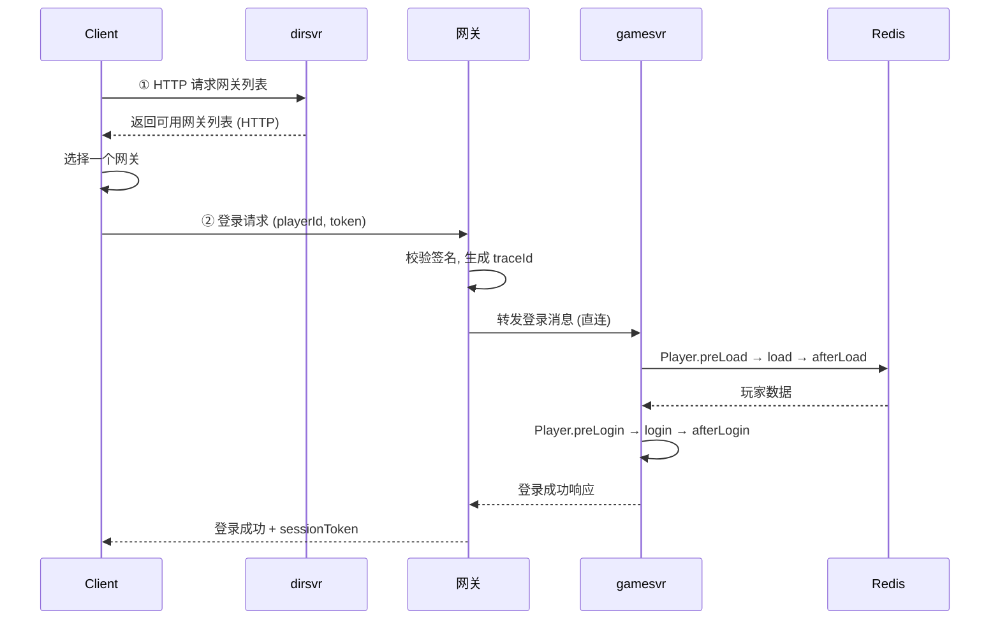

##### 10.2 跨服消息流

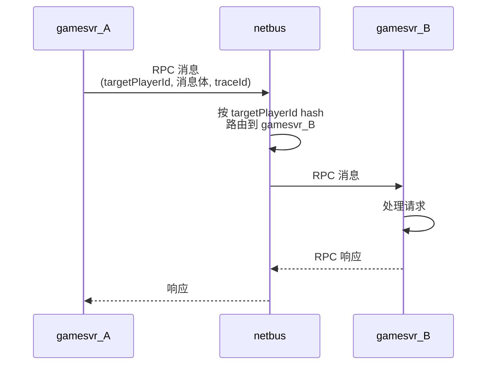

##### 10.3 进入跨服副本

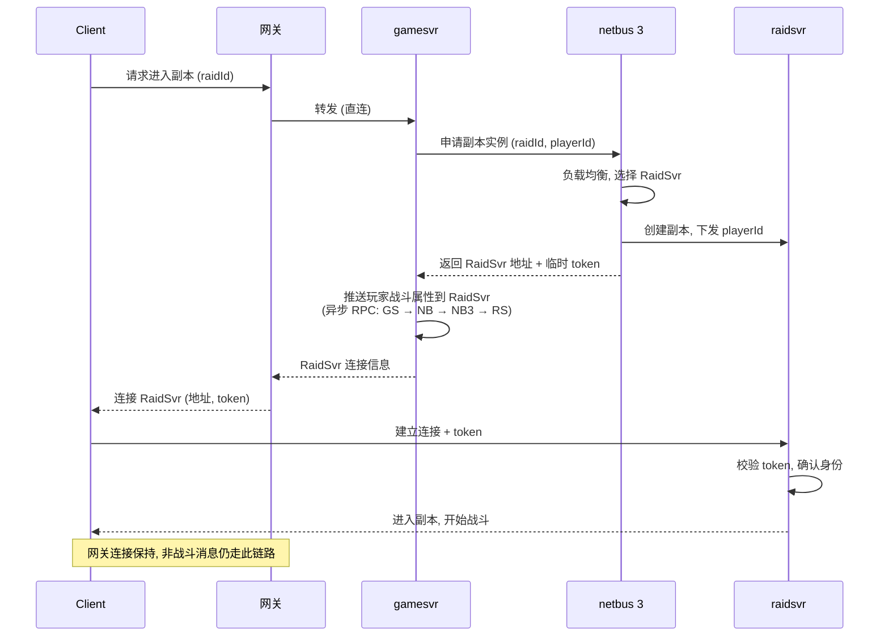

##### 10.4 退出跨服副本

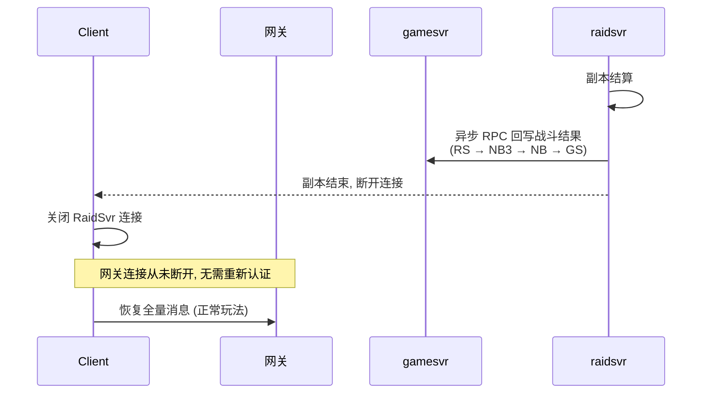

##### 10.5 组队跨服副本

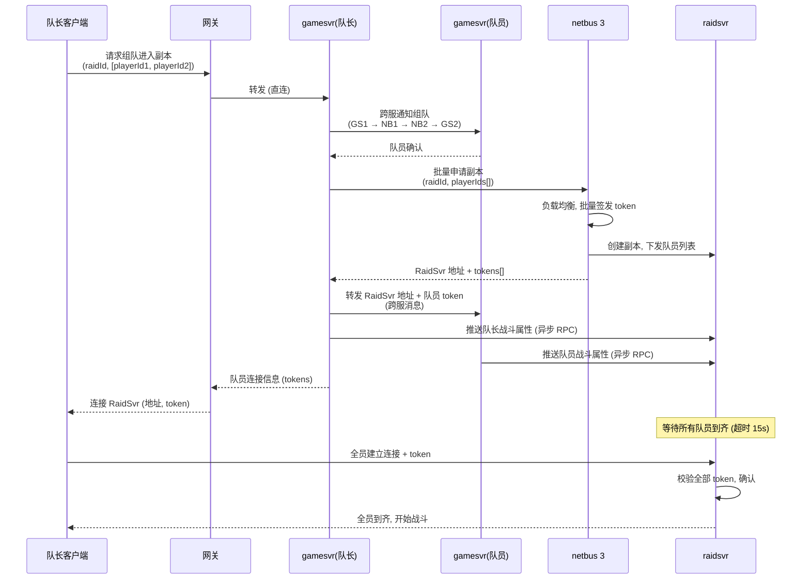

##### 10.6 副本断线重连

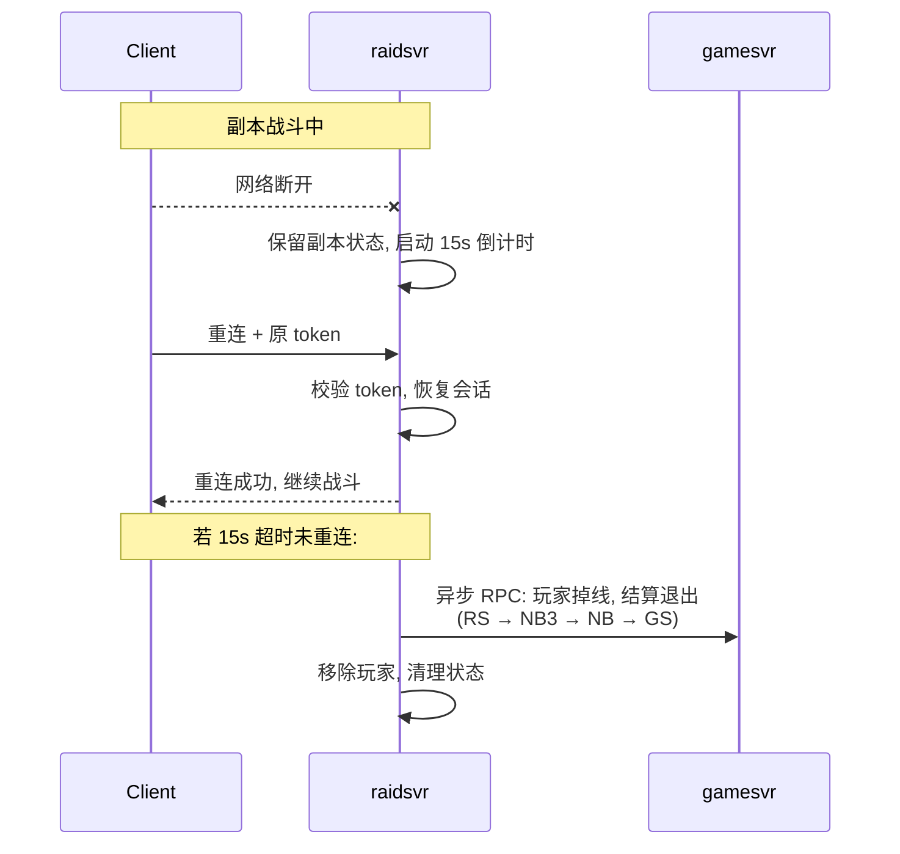
